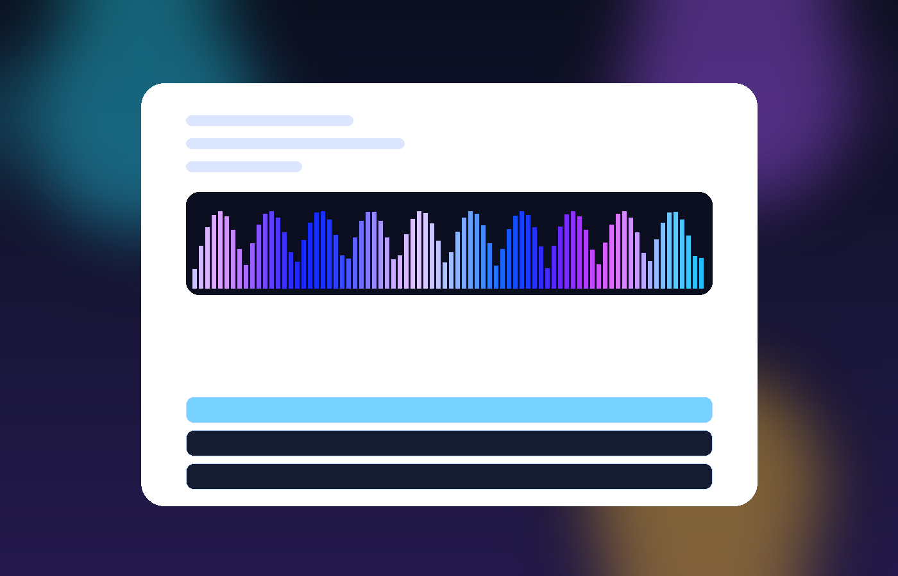
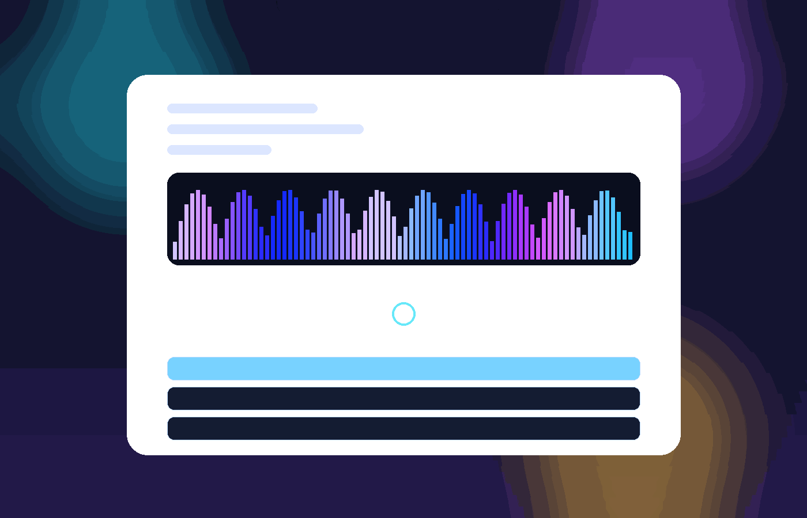

# Wow Web Music Player v2 🎧✨

Showcase-grade web music player on **Vite + React + TypeScript**, optimized for **GitHub Pages**.

- Beat-synced visual FX (bass / mid / treble reactive)
- Dual-deck crossfade engine + smart queue
- Installable PWA with offline cache + offline fallback screen
- Media Session API (lockscreen / headset / system media keys)





---

## Live Demo

- **GitHub Pages:** https://SDV-G-Deploy.github.io/wow-web-music-player/

---

## What’s new in v2

### 1) Beat-synced visual FX
- Real-time audio analysis with smoothed bass/mid/treble energy
- Reactive UI glow/aurora + visualizer bars tied to track dynamics
- FX intensity switch: **low / med / high**

### 2) Crossfade + smart queue
- Dual-audio-deck playback with smooth crossfade (0–8s)
- Shuffle mode with visible queue order
- Repeat modes: **off / all / one**
- Queue UI shows exact upcoming order and allows jump-to-track

### 3) PWA + offline
- Installable as app (`manifest.webmanifest` + service worker)
- Static assets + demo audio are cached
- Dedicated `offline.html` fallback screen for network loss

### 4) Media Session API
- Lockscreen/system controls: play/pause/prev/next
- Current track metadata is published to media session

---

## Features (full)

- ▶️ Play / Pause
- ⏮ / ⏭ Previous / Next
- ⏱ Seek bar with current / total time
- 🔊 Volume slider
- 🎚 Crossfade slider (0–8s)
- 🔀 Shuffle
- 🔁 Repeat mode cycle (`off → all → one`)
- 🌈 Beat-reactive FX with intensity control
- ⌨️ Keyboard shortcuts:
  - `Space` — play/pause
  - `←/→` — seek ±5s
  - `N` / `P` — next/previous track
  - `S` — shuffle on/off
  - `R` — repeat mode cycle
  - `M` — mute/unmute

---

## Tech Stack

- React 19
- TypeScript
- Vite 8
- Web Audio API (analyser + crossfade gains)
- Media Session API
- Service Worker + Web App Manifest
- GitHub Actions (Pages deploy)

---

## Local run

```bash
git clone https://github.com/SDV-G-Deploy/wow-web-music-player.git
cd wow-web-music-player
npm install
npm run dev
```

Open: http://localhost:5173

---

## Build / preview

```bash
npm run build
npm run preview
```

---

## Demo audio generation

Demo tracks are generated locally (copyright-safe synthesis):

```bash
npm run generate:audio
```

Script: `scripts/generate-demo-audio.mjs`

---

## Deployment (GitHub Pages)

Workflow: `.github/workflows/deploy.yml`

1. Push to `main`
2. GitHub Actions runs `npm ci` + `npm run build`
3. Deploys `dist/` to GitHub Pages

This project keeps GitHub Pages compatibility via dynamic Vite `base` in `vite.config.ts`.

---

## License

MIT — see [LICENSE](./LICENSE)
